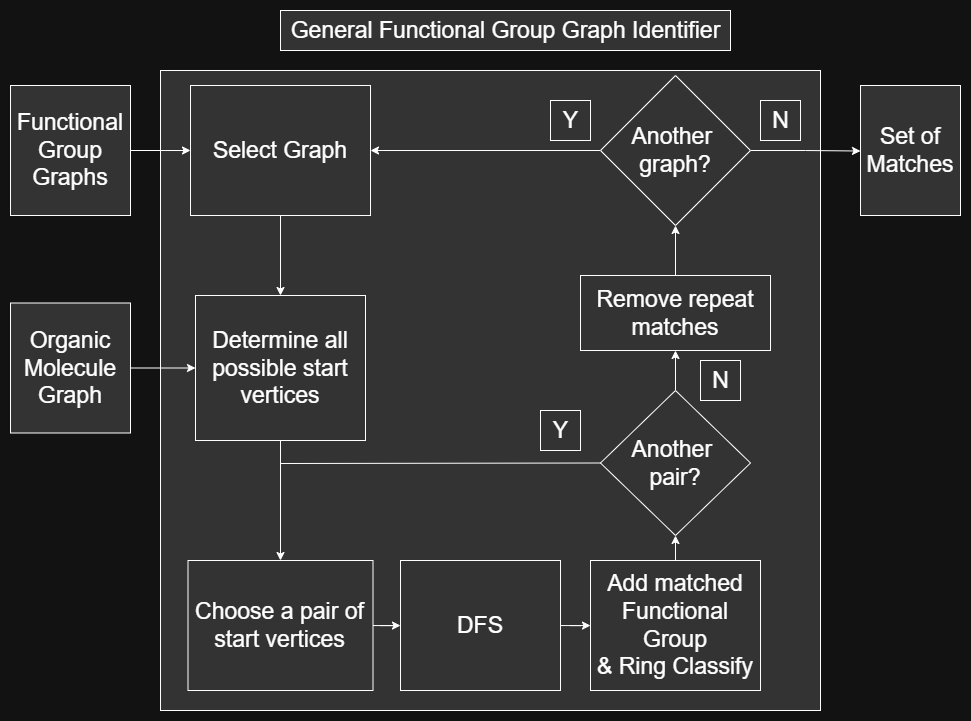
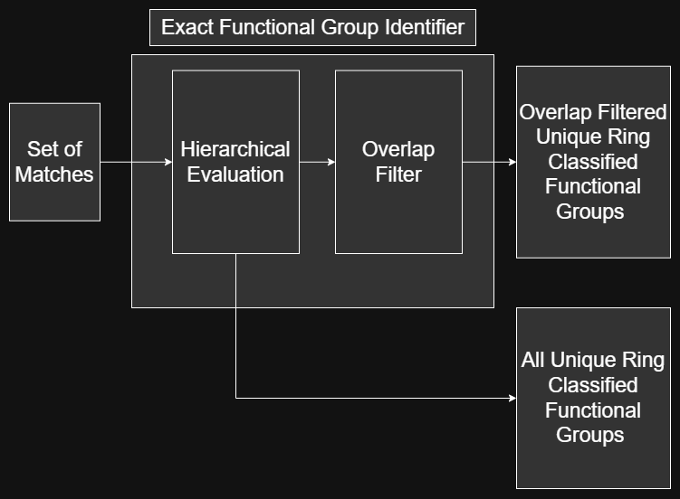

.. _design-ref:

Design
======

Using the discussions from the :ref:`theory-overview-ref`, the graph based functional group identification algorithm capable of ring-classification 
using hydrogen-suppressed SMILES codes developed as part of this project is presented below.

Design Overview
---------------

Given an organic molecule SMILES code and a set of identifiable functional group SMILES codes, the set of unique ring classified functional groups of the given organic molecule
is obtained by executing the procedure below:

.. figure:: _static/SMILES_Based_Functional_Group_Identification.png

    Functional Group Identification Design Overview

The details for the :ref:`smiles-to-graph-converter-ref`, the :ref:`general-functional-group-graph-identifer-ref`, and the :ref:`exact-functional-group-identifer-ref` steps are shown below.

.. _smiles-to-graph-converter-ref:

SMILES To Graph Converter
-------------------------

Following the :ref:`graph-theory-ref`, a molecular graph is obtained from a SMILES code by following the procedure below:

.. figure:: _static/SMILES_To_Graph_Converter.png

    Hydrogen-Supressed SMILES Code To Molecular Graph Converter

The :ref:`vertex-ref` objects of the graph are constructed first using each unqiue atomic symbol of the SMILES code
alongside their valence electron requirements for setup of the hidden hydrogen calculations (See Ref createVertices for more information). 
The :ref:`edge-ref` objects of the graph are constructed next by inspecting the bonds between atoms as listed in the SMILES code. 
Hidden hydrogens are computed during edge construction (see Ref createEdges for more information).
The rings are identified last by counting all rings as `Aromatic` or `Non Aromatic`, and 
distinguishing all vertices as either `Aromatic`, `Non Aromatic`, or `Non Cyclic`. This is achieved by analyzing the numerical ring system of SMILES codes 
(see Ref createRings for more information)

.. _general-functional-group-graph-identifer-ref:

General Functional Group Graph Identifier
-----------------------------------------

A general functional group identification algorithm using a set of identifiable functional group graphs can be executed on an organic molecule graph 
to obtain all instances of unique ring-classified functional groups by following the procedure below:

    General Functional Group Graph Identifier

This procedure makes usage of a depth first search graph algorithm (DFS) to search for a functional group graph within an organic molecule graph. The DFS requires 
a functional group and organic molecule starting vertex pair to begin the search from, and a sucessful DFS returns the set of molecular atoms 
where the functional group is exhibited in the organic molecule (See Ref DFS for more details about the DFS operation). 
This allows the DFS to support ring-classified functional group identifications and prepares functional groups for comparisons during the :ref:`exact-functional-group-identifer-ref`.
All possible starting pairs are computed and tested for each functional group graph, 
so repeated functional group matches when searching for a particular functional group graph instance is common.
Repeat matches are removed after all starting vertex pairs for a particular functional group have been exhausted. This procedure 
repeats until all functional group graphs have been exhausted (See :ref:`implementation-ref` for details).

.. _exact-functional-group-identifer-ref:

Exact Functional Group Identifier
---------------------------------

An exact functional group identification post-processor considering hierarchical and overlapping functional group accuracies can be executed on the output set of functional group 
matches from the :ref:`general-functional-group-graph-identifer-ref` algorithm to obtain the most accurate set of functional groups using the following procedure:

    Exact Functional Group Identifier

The hierarchical evaluation identifies functional groups which are hierarchically related and determines which type is most accurate 
according to their `hydrogen-sensetive R` vertex behaviors in the organic molecule (See :ref:`hierarchical-functional-groups-ref` for details).
The overlap filter removes all functional groups which are overlapped by another functional group (See :ref:`overlapping-functional-groups-ref` for details).
The two sets of functional groups obtained from this process are an `exact` functional groups set without any overlapped functional groups counted
and an `all` functional groups set with overlapped functional groups counted (See :ref:`fg-definitions-ref` for naming details).

