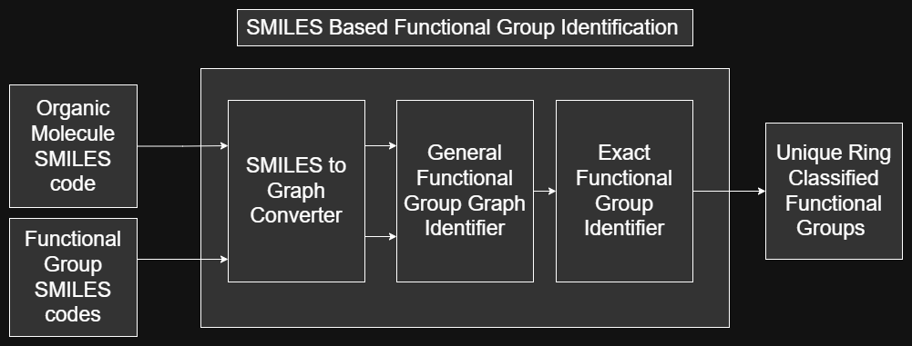
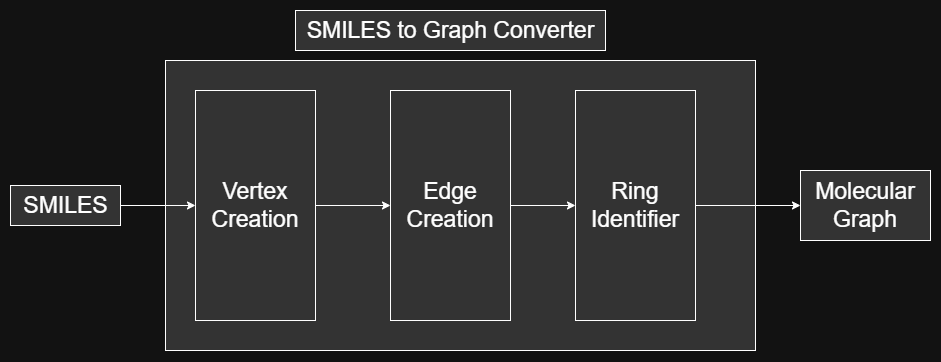
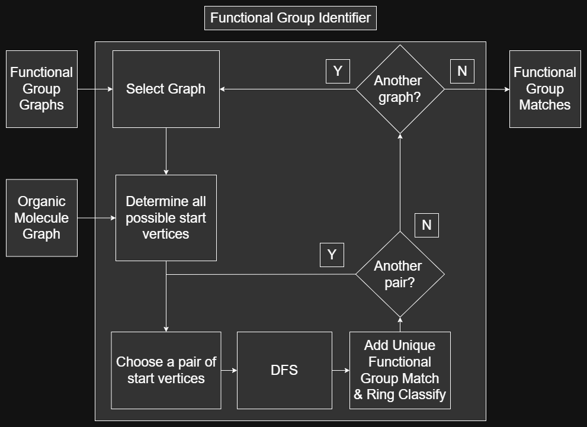
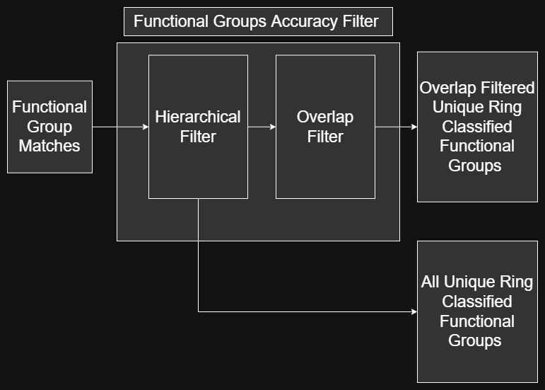

.. _design-ref:

Design
======

This document discusses the components design for functional group identification algorithm capable of ring-classification 
using hydrogen-suppressed SMILES codes.

Design Overview
---------------

Given an organic molecule SMILES code and a set of identifiable functional group SMILES codes, the set of unique ring classified functional groups of the given organic molecule
is obtained by executing the procedure below:

    Functional Group Identification Design Overview

The details for the :ref:`smiles-to-graph-converter-ref`, the :ref:`general-functional-group-graph-identifer-ref`, and the :ref:`exact-functional-group-identifer-ref` steps are shown below.

.. _smiles-to-graph-converter-ref:

SMILES To Graph Converter
-------------------------

Following the :ref:`graph-theory-ref`, a molecular graph is obtained from a SMILES code by following the procedure below:

    Hydrogen-suppressed SMILES Code To Molecular Graph Converter

The three steps are implemented below: 
    
    | Vertex Creation:  :py:meth:`molecule.Molecule.createVertices` 
    | Edge Creation:    :py:meth:`molecule.Molecule.createEdges`        and see :ref:`edges-algorithm-ref` 
    | Ring Identifier:  :py:meth:`molecule.Molecule.createRings`        and see :ref:`rings-algorithm-ref` 

.. _general-functional-group-graph-identifer-ref:

Functional Groups Identifier
----------------------------

A functional groups identification algorithm using a set of identifiable functional group graphs can be executed on an organic molecule graph 
to obtain a set of unique ring-classified functional group matches by following the procedure below:

    Functional Groups Identifier

For implementation details, see below:

    | Functional Groups Identifier: :py:meth:`molecule.Molecule.createFunctionalGroups`     and see :ref:`functional-groups-algorithm-ref`
    | Depth First Search (DFS):     :py:meth:`molecule.Molecule.DFS`                        and see :ref:`depth-first-search-ref`

.. _exact-functional-group-identifer-ref:

Functional Groups Accuracy Filter
---------------------------------

An functional groups accuracy post-processor considering hierarchical and overlapping functional groups can be executed on the output set of functional group 
matches from the :ref:`general-functional-group-graph-identifer-ref` algorithm to obtain the most accurately identifed set of unique ring-classified functional groups using the following procedure:

    Functional Groups Accuracy Filter

For implementation details, see below:

    | Hierarchy Filter:   :py:meth:`molecule.Molecule.hierarchyFilter`    and see :ref:`hierarchy-filter-implementation-ref`
    | Overlap Filter:     :py:meth:`molecule.Molecule.overlapFilter`      and see :ref:`overlap-filter-implementation-ref`        

