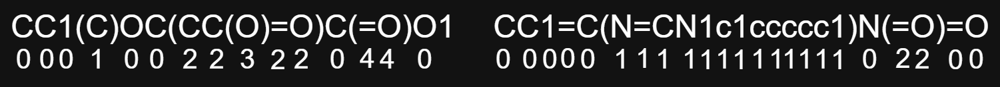
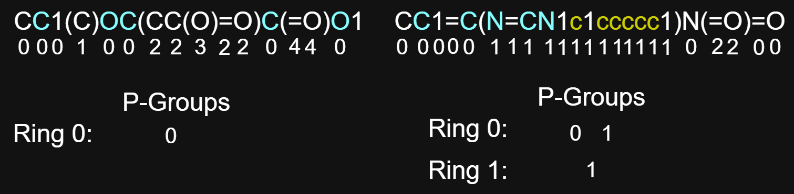

.. _implementation-ref:

Implementation
==============

This document discusses how components of the functional group identification algorithm design are implemented in python. 
View the `Algorithm Variables Reference` section under source code notes for the description of variables used in each algorithm.

.. _edges-algorithm-ref:

Edge Algorithm
--------------

The edge algorithm :py:meth:`molecule.Molecule.createEdges` is designed to construct an :ref:`edge-ref` object for each molecular bond between two atomic symbols that appears in the SMILES code.
Edges of the molecular graph encoded in the SMILES code appear in three different string-level variations: a :ref:`direct-edge-ref`, an :ref:`indirect-parenthetical-edge-ref`, and an :ref:`indirect-number-edge-ref`. 

.. _direct-edge-ref:

Direct Edge
+++++++++++

A direct edge is a bond between two atomic symbols which are in direct *iterative succession* of each other.
They may be seperated by a bond symbol (:py:attr:`edge.Edge.bond_type`), an open parenthetical symbol, or a number. 
This is the most common type of edge in a SMILES code.

Examples: NC, O=C, C#C, C(C...), C(=O), C1C, N3=O,

.. _indirect-parenthetical-edge-ref:

Indirect Parenthetical Edge
+++++++++++++++++++++++++++

An indirect parenthetical edge is a bond between the two atomic symbols to the left and right of a :ref:`Parenthetical Group <parenthetical-groups-ref>`. 

Example: C(...)C, C1(...)C, C(...)(...)C

.. _indirect-number-edge-ref:

Indirect Number Edge
++++++++++++++++++++

An indirect number edge is a bond between the two atomic symbols which appear to the left of a :ref:`like-number-pair-ref`. 

Example: C1....C1, N3...(...C3), 

Implementation
++++++++++++++

The edge algorithm is implemented by iterating symbol-by-symbol over the alphanumeric symbols of the SMILES code and applying symbol case logic which looks for the three edge variations.
The algorithm logic makes usage of atomic index-based tracking variables, such that when any two atomic indices are determined to be involved in an edge, the two vertex objects associated 
with those atomic indices are referenced by index to create a new :ref:`edge-ref` object specifying their bond together (note that the :py:meth:`molecule.Molecule.createVertices` function 
is called before the :py:meth:`molecule.Molecule.createEdges` function, so all vertex objects can be referenced this way).

To search for the three edge variations, the algorithm makes usage of three main variables: the ``match_index``, the ``ring_table``, and the ``parenth_stack``. Also included 
is an ``edge_index`` tracker, a ``bond`` symbol tracker and an ``atom_index`` tracker. These variables are manipulated according to an atom, parenthesis, digit, or bond symbol 
seen in the current step of the symbol-by-symbol iteration.

The ``match_index`` is an edge matching atomic index variable which matches a unique atomic symbol with a corresponding atomic symbol iterated over previously,
inclusive of the most recent ``bond`` symbol that was viewed. The ``match_index`` uses the fact that every atomic symbol in the SMILES code (except for the first) 
forms exactly one edge with an atom located to its *left* in the string. That is, for any atomic symbol except the first in the SMILES code, a 
:ref:`direct-edge-ref` or an :ref:`indirect-parenthetical-edge-ref` can be formed between itself and a single atom located to its *left* in the string. 
For this behavior to be implemented, the ``match_index`` is utilzed to construct an edge whenever a new atomic symbol is landed upon during the symbol-by-symbol iteration.
It references the corresponding atom to the *left* that it is edge bound with. After the edge has been constructed, the ``match_index`` is updated to prepare 
for the next potential edge which will be created later on. Most commonly the ``match_index`` pairs a :ref:`direct-edge-ref` together, however the ``parenth_stack``
works together with the ``match_index`` because the concepts overlap with each other.
The :ref:`direct-edge-ref` is handled using a combination of the atom and bond symbol cases during the symbol-by-symbol iteration to identify its instances.

The ``match_index`` also operates with the ``parenth_stack`` to match :ref:`indirect-parenthetical-edge-ref` types together. When a new opening parenthetical symbol 
is viewed in the SMILES code, the ``parenth_stack`` is pushed with the value of the most recently viewed atomic index. That is, the atom index which appears directly before 
an opening parenthetical symbol is pushed onto the end of the ``parenth_stack``. This prepares for the index of the atomic symbol seen directly after the corresopnding closing 
parenthetical symbol to be edge paired with the atomic symbol which opened the parenthetical group (parenthetical group order sensetive based on the stack functionality). Once the corresponding closing parenthetical symbol is viewed, 
the ``parenth_stack`` is popped from to retireve the atom index next to the corresponding opening parenthetical symbol, and this value is saved into the ``match_index`` variable.
The ``match_index`` look-behind variable is employed on the atom symbol directly after the closing parenthetical symbol to match the two atoms together in an :ref:`indirect-parenthetical-edge-ref`.
This :ref:`indirect-parenthetical-edge-ref` uses a combination of the atom and parenthetical symbol cases during the symbol-by-symbol iteration to identify its instances.

The ``open_ring_table`` uses the concept of a ring :ref:`like-number-pair-ref` and *iterative succession* to determine the :ref:`indirect-number-edge-ref` involved between the numbers. 
It operates by first key-value pairing ring digits not in the ``open_ring_table`` with their direct left atom index value, and then popping the ring digit entry from the ``open_ring_table``
upon finding the ring digit later in the symbol-by-symbol iteration so that the secondary direct left atom index is paired with the first to form a :ref:`indirect-number-edge-ref`. 
This :ref:`indirect-number-edge-ref` is handled under the digit symbol case during the symbol-by-symbol iteration to identify its instances.

Following the creation of the set of edges for the SMILES derived molecular graph, the 
:py:attr:`vertex.Vertex.implicit_degree`, :py:attr:`vertex.Vertex.explicit_degree`, and :py:attr:`vertex.Vertex.total_degree` of each vertex 
is calculated. The explicit degree is equal to the number of edges in the edge set where the vertex appears. The implicit degree is equal to the number of 
hidden hydrogens connected to the vertex (See the :ref:`hidden-hydrogens-computation-ref` for details). The total degree is the additive 
sum of both of these numbers. 

.. _rings-algorithm-ref:

Ring Identifier Algorithm
-------------------------

The ring identifier algorithm :py:meth:`molecule.Molecule.createRings` is designed to identify the number of aromatic rings, the number of non-aromatic rings, 
and indices of all vertices which are aromatic and non-aromatic from a SMILES code (:py:attr:`vertex.Vertex.ring_type`).
These data can be collected by using the concepts of a :ref:`like-number-pair-ref`, :ref:`parenthetical-groups-ref`, 
:ref:`ring-assigned-parenthetical-groups-ref` and :ref:`open-rings-ref` during a symbol-by-symbol iteration over the SMILES code. 

.. _like-number-pair-ref:

Like Number Pair
++++++++++++++++

A *like number pair* is a unique pairing of two equal value digits in a SMILES code that identifies a single ring in a molecular structure.
*Like number pairs* are formed based on *iterative succession* of arbitrary equal numbers in the SMILES code, 
and they identify an :ref:`indirect-number-edge-ref` as well as the indices of all vertices apart of its single ring structure.

The behavior of *iterative succession* of arbitrary equal numbers to form *like number pairs* for unique rings is described below using two examples:

| Example One: C1CCN(CC1)CCN1CCCCC1 DAGLII
| Example Two: O=C1Oc2ccccc2C=C1 COUMAR11

Irrespective of the specific digit value, the behavior of an equal digit appearing twice in *iterative symbol succession* indicates the start and stop positions 
for where a ring begins and ends in the SMILES code. In the case of example one, there are two *like number pairs* using the digit `1`, and 
each is distinguishable from one another based on the *iterative succession* of equal digit `1`'s as they appear from left to right in the SMILES code.
In example two, there are two *like number pairs* again, but this time they each use the digits `1` and `2`. 
When multiple new rings start in *iterative succession* of one another before their stop positions are located, the SMILES code 
uses incrementing digit value to uniquely identify them. This incrementing continues as long as new rings start, and the the order in which the 
stop positions appear is irrelevant. 

The first number in a *like number pair* is called the start number, and the index of the atomic symbol which comes directly before the start number is called the start atom index. 
Additionally, the second number in a *like number pair* is called the stop number, and the index of the atomic symbol which comes directly before the stop number is called the stop atom index.
Digit values which define a *like number pair* may be re-used as long as they follow *iterative succession* to uniquely identify the ring.

.. _parenthetical-groups-ref:

Parenthetical Groups
++++++++++++++++++++

A parenthetical group is a set of symbols between an opening and closing parenthesis symbol pair which can be uniquely grouped together using an integer index. 
Below are two examples of SMILES codes whose parenthetical groups are labeled using their integer indices:

    Example of parenthetical groups labeled in two organic SMILES codes

Opening and closing parenthetical symbol pairs form parenthetical groups following a Last In First Out (LIFO) ordering of a *stack*, wherein open parenthesis 
push onto the stack and close parenthesis pop from the stack. Open parenthesis pushed onto the stack increment the integer index and close parenthesis 
pop from the stack to return to a previous parenthetical group. Parenthetical group `0` is always in the stack as it represents the root group where 
no parenthetical pair is defined (as if there is a parenthetical pair around the entire SMILES code called the root group, with the auto-assigned index of `0`).
Parenthetical groups which have seen their opening parenthetical symbol are called *open* parenthetical groups.

The index of the first atom symbol to the left of an open parenthetical symbol in a parenthetical pair 
is called the parenthetical start atom index, and the atom index of the first atom symbol to the right of the corresponding 
closing parenthetical symbol in a parenthetical pair is called the parenthetical stop atom index.

.. _ring-assigned-parenthetical-groups-ref:

Ring Assigned Parenthetical Groups
++++++++++++++++++++++++++++++++++

The indices of the atomic symbols (vertices) of a ring that are encapsulated between a *like number pair* are *dependent* on its set of allowable parenthetical groups. 
The set of allowable parenthetical groups where atoms of a *like number pair* may appear is defined as the set of *open* parenthetical groups between the *like number pair*. 
That is, only within these ring assigned parenthetical groups may vertices apart of the ring be located.
An example of ring assigned *parenthetical groups* is shown below:

    Example of ring assigned parenthetical groups in two hydrogen-suppressed organic molecule SMILES codes

.. _open-rings-ref:

Open Rings
++++++++++

Open rings are a symbol by symbol iteration concept wherein a :ref:`like-number-pair-ref` which has seen their start number are called *open rings*, and they 
remain as *open rings* until their corresponding stop number is reached. The ring which has most recently been opened is called the *most recently opened ring*.

Implementation
++++++++++++++

:ref:`like-number-pair-ref`, :ref:`parenthetical-groups-ref`, :ref:`ring-assigned-parenthetical-groups-ref` and :ref:`open-rings-ref` are utilized during 
several symbol-by-symbol iterations over the SMILES code to determine its number of aromatic and non-aromatic rings and to determine 
its aromatic and non-aromatic vertex indices. 
The ring identifier algorithm achieves this in three main steps: preparation, identification, and collection.

Preparation
"""""""""""

The preparation step of the ring identifier algorithm is a symbol-by-symbol iteration over the SMILES code that 
creates its :ref:`ring-assigned-parenthetical-groups-ref` with the ``ring_info`` variable. 
The ``ring_info`` variable assigns the ``ring_index`` (a unique integer identifier for each *like number pair* in the order that new rings start in) 
as key to the set of allowed *parenthetical groups* as values for every *like number pair* in the SMILES code. The allowed *parenthetical groups* per ring are computed 
with a parenthetical groups index counter called ``p_groups_counter`` dependent upon parenthetical symbols.
Open parenthetical symbols increment the ``p_groups_counter`` and push it onto the ``parenth_group_stack``, 
and close parenthetical symbols pop from the ``parenth_group_stack`` without any change to the variable.
The ``parenth_group_stack`` perserves order of the parenthetical groups, and the last element in the stack ``parenth_group_stack[-1]`` is 
the current parenthetical group index where the symbol-by-symbol iteration is on. 
Using this ``p_groups_counter`` variable, open parenthetical symbols cause all :ref:`open-rings-ref` to pre-emptively recieve its value 
in their set of allowable parenthetical groups. Accordingly, this value is removed upon for all :ref:`open-rings-ref` upon 
finding the closing parenthetical symbol for the group, since it does not meet the open parenthetical group conditional to add its index to the set 
of allowable parenthetical groups for each ring. Only :ref:`open-rings-ref` are mutated and rings which are no longer open are not mutated.

Identification
""""""""""""""

The identification step of the ring identifier algorithm uses another symbol-by-symbol iteration over the SMILES code to fill the ``ring_set`` and 
``ring_atom_indices`` data structures.
The ``ring_set`` is a dictionary of key ``ring_index`` to value of indices which are apart of its ring, 
and ``ring_atom_indices`` is the set of atom indices which appear in any ring. The identification step achieves this by utilzing the 
*most recently opened ring* in conjunction with the :ref:`ring-assigned-parenthetical-groups-ref`. More specifically, 
if an atom symbol is in the *most recently opened ring's* allowable parenthetical group, then the index of this atom 
belongs to the ``ring_index`` of the *most recently opened ring*. Furthermore, if an atom symbol is in any of the :ref:`open-rings-ref` assigned parenthetical 
group, then regardless of :ref:`Open Ring <open-rings-ref>` order, the index of this atom symbol is within a ring structure. 
Leverging these two logic upon the case of an atom symbol, alongside a re-usage of the ``parenth_group_stack``, ``ring_index``, ``atom_index``, and ``p_groups_counter`` trackers, then 
the ``ring_set`` and ``ring_atom_indices`` are created. 
Note that the ``ring_set`` is only designed for aromatic rings, such that the atom indices which are labeled for non-aromatic rings *fails* to distinguish each atom 
exactly. However, this result is negligible because it does not impact the overall accuracy of data collection during the collection step. 

Collection
""""""""""
The collection step of the ring identifier algorithm applies the ``ring_set`` and ``ring_atom_indices`` data structures, and the fact that all aromatic indices are 
already labeled based on the lower case symbol conditional of SMILES codes, to collect the 
number of aromatic and non-aromatic rings and to label non-aromatic atomic indices. The first is achieved by 
using the ``ring_set`` to distinguish aromatic rings from non-aromatic rings. That is, any entry in the ``ring_set`` which has 
all aromatic indices increments the count of aromatic rings, while entries which fail this test increment 
the count of non-aromatic rings. 
The second is achieved adding the non-aromatic label to all indices in the ``ring_atom_indices`` set which are not aromatic (since if 
the index appears in this list, and it is not already aromatic, then it must be non-aromatic).

.. _hidden-hydrogens-computation-ref:

Hidden Hydrogens Computation
----------------------------

Hidden hydrogens connected to atoms in a hydrogen-suppressed SMILES code can be computed using the atomic properties of valence electrons [1]_ and electron configuration [2]_.
These atomic propeties compute the number of *required valence electrons* to be provided by bonds to each atom in the hydrogen-suppressed SMILES code to fulfill each of their preferred electron configurations.

*Required valence electrons* provided by bonds in a hydrogen-suppressed SMILES code may come from *explicitly listed edges* that specify single, double, or triple bonds 
with non-hydrogen atoms, or from *implicit hydrogens* that are suppressed in the hydrogen-suppressed SMILES code.

Accordingly, hidden hydrogens are computed in IFG through the following procedure:

1. Compute the number of *required valence electrons* per vertex inclusive of charge alterations during the :py:meth:`molecule.Molecule.createVertices` method
2. Create the edges of the hydrogen-suppressed SMILES graph during the :py:meth:`molecule.Molecule.createEdges` method
3. Compute the number of explicit electrons provided by *explicitly listed edges* for each vertex
4. Compute the number of hidden hydrogens for each vertex as: *required valence electrons* - number of explicit electrons.

Both organic molecule and functional group molecular graph vertices specify their number of hidden hydrogens on the :py:attr:`vertex.Vertex.implicit_degree` property in the :ref:`vertex-ref` class.
Any R vertex is automatically assigned 0 hidden hydrogens due to their role as any single bound vertex in functional groups.

.. _depth-first-search-ref:

Depth First Search Algorithm
----------------------------

The depth first search (DFS) algorithm searches for a functional group graph inside of an organic molecule graph.
It uses the concepts of :ref:`like-vertex-pair-ref`, :ref:`valid-paths-ref`, :ref:`backtracking-ref`, 
and :ref:`search-exhaustion-ref` to drive logic for the recursive :py:meth:`molecule.Molecule.DFS` function.
For a visualization of a depth first search algorithm, check out `this depth first search visualization`_ 
from the university of San Fransisco and use a test run with any start vertex.

.. _like-vertex-pair-ref:

Like Vertices
+++++++++++++

*Like vertices*, or a *like vertex pair*, are two non-R vertices which have the same symbol and the same total degree (see :py:attr:`vertex.Vertex.total_degree`). 
These are ``fg_vertex`` and ``mol_vertex`` in the :py:meth:`molecule.Molecule.DFS` function.

.. _valid-paths-ref:

Valid Paths
+++++++++++

A :ref:`valid path <valid-paths-ref>` is a single step/jump to a new :ref:`like vertex pair <like-vertex-pair-ref>` over a unique pair of equivalent bond type edges. 
This is a conditional wrapper for the recursive ``path`` variable in the :py:meth:`molecule.Molecule.DFS` function. 

.. _search-exhaustion-ref:

Search Exhaustion
+++++++++++++++++

*Search exhaustion* is when there are no unique :ref:`valid-paths-ref` which can be taken from a :ref:`like vertex pair <like-vertex-pair-ref>`. This is the base case for the :py:meth:`molecule.Molecule.DFS` function.

.. _backtracking-ref:

Backtracking
++++++++++++

*Backtracking* is a reverse :ref:`valid path <valid-paths-ref>` step to a previous :ref:`like vertex pair <like-vertex-pair-ref>` in the recursive call stack upon :ref:`search exhaustion <search-exhaustion-ref>`. 
This carries the cumulative ``matched_indices`` dictionary, ``used_mol_edges`` list, and ``used_fg_edges`` list as return data in the :py:meth:`molecule.Molecule.DFS` function.

Implementation
++++++++++++++

A functional group sub-graph is identified in an organic molecule graph by establishing a :ref:`like vertex pair <like-vertex-pair-ref>` 
between every *core* functional group vertex and a set of vertices in the organic molecule graph.
As such, the recursive DFS algorithm is designed to search for a :ref:`like vertex pairing <like-vertex-pair-ref>` between every *core* 
functional group vertex and a set of vertices in the organic molecule graph.
It achieves this by operating in recursive steps over :ref:`like vertex pairs <like-vertex-pair-ref>` linked by :ref:`valid paths <valid-paths-ref>`. 
:ref:`Valid paths <valid-paths-ref>` use a unique and equivalent molecular and functional group edge pair 
(connected to the :ref:`like vertex pair <like-vertex-pair-ref>`) to establish a link to a *core* functional group vertex which has yet to be :ref:`like vertex paired <like-vertex-pair-ref>`. 
:ref:`Valid paths <valid-paths-ref>` are taken in a depth first manner, wherein the first unique pair of edges 
that can form a :ref:`valid path <valid-paths-ref>` to an un-fulfilled *core* functional group vertex 
trigger a recursive call to the :py:meth:`molecule.Molecule.DFS` function. 
The :py:meth:`molecule.Molecule.DFS` function calls itself into the ``path`` search variable with the arguments of the new :ref:`like vertex pair <like-vertex-pair-ref>` where the :ref:`valid path <valid-paths-ref>` leads to, 
and adds the edges used in the :ref:`valid path <valid-paths-ref>` to the lists of consumed molecular and functional group edges since :ref:`valid paths <valid-paths-ref>` cannot be re-used
during any other step of the recursive function (doing so would be erroneous).

DFS recursion through unique :ref:`valid paths <valid-paths-ref>` to new :ref:`like vertex pairs <like-vertex-pair-ref>` continues in this manner until the base case condition of :ref:`search exhaustion <search-exhaustion-ref>` is reached. 
:ref:`Search exhaustion <search-exhaustion-ref>` may be reached when there are no more connected *core* functional group vertices which need to be paired with a :ref:`valid path <valid-paths-ref>`, or when some of the connected *core* functional group 
vertices which needed to be paired failed to be paired with a :ref:`valid path <valid-paths-ref>`. 
In either case, :ref:`search exhaustion <search-exhaustion-ref>` stops the search recursion and triggers :ref:`backtracking-ref` to previous
:ref:`like vertex pairs <like-vertex-pair-ref>` in the recursive chain of depth first search :ref:`valid paths <valid-paths-ref>`. 
The :ref:`backtracking <backtracking-ref>` carries a recursively cumulative set of data into the ``path`` search variable about 
the consumed molecular and functional group edges (``used_mol_edges`` and ``used_fg_edges``)
and about the organic molecule and functional group vertex index pairings (``matched_indices``)
seen across the accumulation of all recursively established :ref:`valid paths <valid-paths-ref>`. 
The :ref:`backtracking <backtracking-ref>` data accumulation into the ``path`` variable ensures no edges are erroneously re-used on any recursive step (including itself), 
ensures that functional group search results are distinguishable as succesful or failed, and prepares functional group search matches to be analyzed 
by post-processing methods for accurate functional group results during the :py:meth:`molecule.Molecule.createFunctionalGroups` function.
:ref:`Backtracking <backtracking-ref>` carries this accumulated data around all :ref:`like vertex pairs <like-vertex-pair-ref>` until :ref:`search exhaustion <search-exhaustion-ref>` occurs on the inital :ref:`like vertex pair <like-vertex-pair-ref>` of the :py:meth:`molecule.Molecule.DFS` function to
exit the algorithm and complete the search.

The search results of either a succesful functional group search or a failed search are based on the results of the final ``matched_indices`` index pairing dictionary. 
A succesful search result shows that the number of entries in the final ``matched_indices`` dictionary is equal to the total number of *core* functional group vertices,
while failed search results show an inequality. The reason for this is that the ``matched_indices`` accumulation through :ref:`backtracking <backtracking-ref>` 
may carry all or only partial :ref:`like vertex <like-vertex-pair-ref>` index pairings for the *core* functional group vertices to 
organic molecule vertices. For ``matched_indices`` results which have a number of entries equal to the number of *core* functional group vertices, 
then the search was able to :ref:`like vertex pair <like-vertex-pair-ref>` every *core* functional group vertex with an organic molecule vertex, and this 
indicattes that a functional group sub-graph structure is present in the organic molecule graph. Therefore the functional group exists 
inside of the organic molecule.

During the DFS algorithm, the implicitly listed hidden hydrogen and *R* group requirements connected to *core* functional group vertices do not participate in creation of 
:ref:`valid paths <valid-paths-ref>`, but they nontheless are essential for functional group identification. Instead, their fulfillments fall under degree equality checks during each recursive step of the DFS algorithm. 
More specifically, hidden hydrogens connected to a *core* functional group vertex are fulfilled by checking if there exists 
at least enough hidden hydrogens connected to the corresponding organic molecule vertex by using the :py:attr:`vertex.Vertex.implicit_degree` property. 
Since hidden hydrogens may be used in *R* groups as well, only an at least condition is required.
Furthermore, any *R* groups connected to a *core* functional group vertex which are defined 
generally as any single bound vertex as listed `here`_
are fulfilled automatically under the :ref:`like vertex pair <like-vertex-pair-ref>` total degree equality condition using the :py:attr:`vertex.Vertex.total_degree` property.
The reason that the :py:attr:`vertex.Vertex.total_degree` condition satisfies any *R* groups when using the general definition `here`_ 
is because the :py:attr:`vertex.Vertex.total_degree` condition ensures that the number of 
bond-provided electrons between the :ref:`like vertex pair <like-vertex-pair-ref>` is the same (see :ref:`hidden-hydrogens-computation-ref` for more details). 
Given that the number of bond-provided electrons is equal between a :ref:`like vertex pair <like-vertex-pair-ref>` and 
that all double or triple bonds will always appear as *core* functional group veretx connected requirements that need a :ref:`valid paths <valid-paths-ref>` to match with, 
then if all *core* functional group vertex requirements connected to a :ref:`like vertex pair <like-vertex-pair-ref>` are satisfied, then there must exist enough implicit or explicit single bonds to other vertices to fulfill
any remaining *R* group requirements for the *core* functional group vertex.

.. _functional-groups-algorithm-ref:

Functional Groups Algorithm
---------------------------

The functional groups algorithm is designed to leverage the :ref:`depth-first-search-ref` to determine 
all unique ring-classified instances of functional groups in an organic molecule from a set of identifiable functional group SMILES codes.

.. _per-functional-group-identification-process-ref:

Functional Group Processing
+++++++++++++++++++++++++++

Each functional group in the set of SMILES defined identifiable functional groups is iterated over to identify all of its unique instances in the organic molecule. 
The iteration accomplishes this by setting up the :ref:`depth-first-search-ref` to execute using all possible initial :ref:`like vertex pairs <like-vertex-pair-ref>` for all *core* functional group vertices 
and their matching organic molecule vertices. This method ensures that no instance of a particular functional group is missed and that any instance of a functional group which occupies 
a unique set of vertices in the organic molecule is matched. Each DFS execution yields a ``matched_indices`` result which must pass two conditions in order to be saved as a unique match:

1. The ``matched_indices`` must have a number of entries equal to the number of *core* functional group vertices (match condition).
2. The set of organic molecule vertices where the functional group appears must be unqiue with respect to any other previous match (unique condition).

These two conditions filter out unique matches made by the DFS algorithm when using all possible :ref:`like vertex pairs <like-vertex-pair-ref>` to begin the DFS algorithm.

Each functional group iterated over during the iteration over all SMILES defined identifiable functional groups can be broken down into the following steps
to determine all of its unique instances:

1. The functional group SMILES code is converted to its graphical format using the :ref:`molecule-ref` class (``fg`` in :py:meth:`molecule.Molecule.createFunctionalGroups`).
2. All possible initial :ref:`like vertex pairs <like-vertex-pair-ref>` between the *core* functional group vertices and matching organic molecule vertices is calculated (``like_vertex_pairs`` in :py:meth:`molecule.Molecule.createFunctionalGroups`).
3. The :py:meth:`molecule.Molecule.DFS` algorithm is executed using every possible intial :ref:`like vertex pair <like-vertex-pair-ref>`, and ``matched_indices`` results which pass the unique match conditionals are added to a list of matches.
4. Each ``matched_indices`` unique match is used to construct a new functional group :ref:`molecule-ref` object where its internal vertices are overwritten to match their organic molecule vertices,
   and ring-classifications based on vertex exsistence inside of ring structures in the organic molecule is calculated
5. Each new overwritten functional group :ref:`molecule-ref` object is added to a global list of all functional group matches (``all_fgs`` in :py:meth:`molecule.Molecule.createFunctionalGroups`)
   

Accuracy Filtering
++++++++++++++++++

The :ref:`per-functional-group-identification-process-ref` determines all unique ring-classified functional group instances in the organic molecule in the format of 
:ref:`molecule-ref` objects. However, the ``all_fgs`` list of matches after every functional group has been processed through the :ref:`per-functional-group-identification-process-ref` 
will carry hierarchically related functional groups as well as overlapping functional groups. More specifically, the entire hierarchy of a hierarhcical set of functional groups 
will exist in the ``all_fgs`` list of matches due to the application of the general *R* groups definition in the :ref:`depth-first-search-ref` 
(see :ref:`hierarchical-functional-groups-ref` for details about this). Futhermore, overlapping functional groups will exist due to the ability for unique functional group instances 
to overlap with one another (see :ref:`overlapping-functional-groups-ref` for details about this).

These two types of functional groups pose accuracy issues when inspecting the final result of functional groups in the ``all_fgs`` list of matches. In order to handle these two 
type of functional groups related to accuracy, the :ref:`hierarchy-filter-implementation-ref` and :py:meth:`molecule.Molecule.overlapFilter` functions are applied as post-processing
accuracy functions on the list of ``all_fgs`` to produce the most accurate results of functional group identification in the organic molecule. Once these two filters are applied
to the ``all_fgs`` list of matches, then the two finalized functional group data formats called `all` and `exact` are produced, where both are hierarchically filtered, but only the latter 
is overlap filtered. The two results can be converted into dictionary counted instances of functional group names to extract into other data formats, such as an excel sheet. 

.. _hierarchy-filter-implementation-ref:

Hierarchy Filter 
----------------

Hierarchy filter (:py:meth:`molecule.Molecule.hierarchyFilter`) is a hierarchical functional group accuracy evaluation filter which decides the most accurate hierarchical type of functional group in each hierarchically realted set 
of functional groups output from the :ref:`general-functional-group-graph-identifer-ref`. For sets of hierarhcically related functional groups, the entire hierarchy is identifed 
by the :ref:`depth-first-search-ref` due to the usage of the general definition of `R` groups `here`_.
Hierarchical accuracy evaluation is an automatic post-processing technique executed on the set of matches output from :py:meth:`molecule.Molecule.createFunctionalGroups` algorithm
to handle the issues discussed with the `R` group definition in the :ref:`hierarchical-functional-groups-ref`.

All hierarchical functional groups must be evaluated for `hidden hydrogen exactness` to determine if it should be kept or discarded, regardless of which hierarchy it is apart of.
The `hidden hydrogen exactness` test decides *if the number of hidden hydrogens at each functional group vertex is equal to the number of hidden hydrogens shown in their corresopnding organic molecule vertices*.

The filter is thus broken down into three steps:

1. Add all functional groups which are apart of a hierarchical set to an evalutation set by identifying groups which have the same `core` structure and `core` indices in the organic molecule
2. Apply the `hidden hydrogen exactness` test to all functional groups in the evalutation set, and mark the failed test index positions in the list of matches
3. Apply an index filter to the list of matches by removing the failed indices

After step 3, only the hierachical functional groups most accurate to their `hydrogen-sensetive R` group behavior in the organic molecule remain.

.. _overlap-filter-implementation-ref:

Overlap Filter 
--------------

Overlap filter (:py:meth:`molecule.Molecule.overlapFilter`) is an overlapping functional group accuracy evaluation filter which removes smaller functional groups which overlap with another larger functional group.

The filter is broken down into two steps:

1. Indetify and index mark functional group matches whose entire set of *core* vertices fall under the *core* set of another functional group which has more overall *core* vertices
2. Apply an index filter to the list of matches by removing the overlapped functional groups

After step 2, all functional groups with a smaller set of *core* vertices which entirely fall under another functional groups larger set of *core* vertices are removed. 
In other words, all overlapped functional groups are removed from the list of matches.

.. rubric:: Footnotes
.. [1] Valence Electrons Wikipedia Page https://en.wikipedia.org/wiki/Valence_electron
.. [2] Electron Configuration Wikipedia Page https://en.wikipedia.org/wiki/Electron_configuration

.. _here: http://www.chem.ucla.edu/~harding/IGOC/R/r_group.html#:~:text=R%20group%3A%20An%20abbreviation%20for,halogens%2C%20oxygen%2C%20or%20nitrogen.
.. _this depth first search visualization: https://www.cs.usfca.edu/~galles/visualization/DFS.html