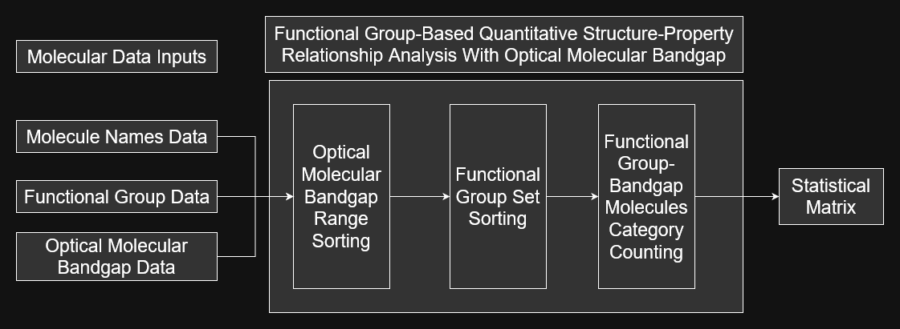
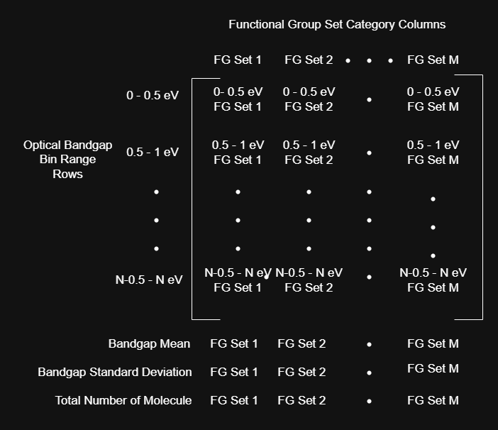

.. _analysis-script-ref:

Functional Group-Based Structure Property Relationship Trends Script
====================================================================

The ``analysis.py`` (or ``analysis.ipynb``) script analyzes functional group molecular data (output from the ``main.py`` script)
for quantitative structure-property relationship trends. The target property that the ``analysis.py`` script is designed for is called the optical molecular bandgap (also called the bandgap). 

.. _analysis-script-computation-ref:

Computation Overview 
--------------------

The analysis script computation steps for quantitative structure-property relationship trends are shown below: 

  Analysis Computation Steps

The script takes in a tabular molecular dataset of variable size with each row having the data of molecule name, molecule functional groups, and molecule bandgap energy. 
It then sorts the molecular dataset into sub-datasets dependent upon particular numerical bandgap ranges. It finally sorts those sub-datasets further into functional group 
sub-datasets dependent upon particular sets of exhibited functional groups in molecules. The results of the sorting are datasets of molecules categorized by 
a particular range of bandgap and a particular set of exhibited functional groups. 

Utilizing the categorizations in a quantiative structure-property relationship trend, the script counts the number of 
molecule entries in each functional group-bandgap categorized dataset and places each integer value into the cell of a statistical matrix called the 
:ref:`functional group-bandgap statistical matrix <statistical-matricies-ref>`. This matrix ideally reveals a structure-property relationship between a present 
set of functional groups in a molecule and a general molecular optical bandgap numerical value through investigation of the quantity of molecules which fall 
into a particular functional group-bandgap cateogry. 

Script Details
--------------

On the `github repository <https://github.com/wtriddle/IFG>`_,  the user will find the input molecular dataset, the ``analysis.py`` (or ``analysis.ipynb``) script, 
and sample output datasets under the `ifg/scripts` folder. The ``analysis.py`` is a concise single runtime script to generate the output dataset into an excel sheet, 
while the ``analysis.ipynb`` is a verbose cell-by-cell python notebook environment designed to help individuals better understand python code and the steps 
involved in the :ref:`quantiative structure-property relationship trend computations <analysis-script-computation-ref>` described above.

.. note:: 
  The ``analysis.py`` and ``analysis.ipynb`` scripts use a functional group dataset generated from the ``main.py`` script 
  and a bandgaps dat set generated using techniques in ref [1]_ as data inputs for its default statistical quantitative structure-property relationship computations.

A word on the research related purposes of this script from the authors of this research. 
This script creates statistical data that can be useful for building a Quantitative Structure-Property Relationship (QSPR) prediction model,
with functional groups as structural descriptors and the bandgap as a target molecular property. 
We hope that this demonstrates the usefulness of the :ref:`chem-package-ref` for QSPR based research and that it will lead to further types of research 
and investigation surrounding functional groups of molecules. This may include a machine learning model, raw data collection, and other related applications.

Set Up The Script
-----------------

First, follow the :ref:`installation-ref` steps to set up the scripting environment.

Input Excel Files
+++++++++++++++++

The script uses two excel files as input, one for functional groups dataset and another for bandgap. The script concatinates the data together 
per molecule to then perform its statistical processing. The ``MAIN_OUTPUT_PATH`` is for the functional groups (intended to be generated 
for a set of molecules by using the ``main.py`` script beforehand) and the ``BANDGAPS_PATH`` is for the bandgaps (intended to be generated 
through user means). 

.. note:: 
    The data loading nature of this script requires the user to understand the format of thier own 
    data and how the data reaches into the script. The user can view the ``analysis.ipynb`` for detailed info.

Output Excel Files
++++++++++++++++++

The script outputs one excel file that can be targeted by the user with the ``ANALYSIS_OUTPUT_PATH`` variable. You can view the variable 
in either script and change its file output location. 

Run The Script
--------------

To run the ``analysis.py`` script, run the following `CLI <https://en.wikipedia.org/wiki/Command-line_interface>`_ command in your `/ifg/scripts` directory:

.. code-block:: 
    :caption: CLI Script Run Command

    (active-ifg-poetry-environment) C:\IFG\ifg\scripts> poetry run python analysis.py

This will load the excel data, perform the analysis, and output the default matricies in a single runtime. 
Once it is complete, you will see the output excel sheet with your :ref:`statistical matricies <statistical-matricies-ref>`.

To run the ``analysis.ipynb``, open a jupyter notebooks-like environment such as jupyter-labs (which is available with this repository through the poetry environment)
and execute each cell. Note that the set-up is the same for this script and will help show users how the python script works step by step.

View the Outputs
----------------

Once the script has completed running, you can view the ``ANALYSIS_OUTPUT_PATH`` excel file you configured before running the script.

.. _statistical-matricies-ref:

Staistical Matrix Script Output
-------------------------------

The statistical matrix output from the ``analysis.py`` (or ``analysis.ipynb``) script comes in a format described in the figure below: 

    Staistical Matrix Format

The rows specify a particular numerical range of bandgap value for molecules 
and the columns specify a particular set of functional groups present in molecules. 
Each cell value in the matrix is the number of molecules which exhibit both of the row/column properties in their 
chemical makeup. 

While a molecule can only fall into one bandgap numerical range category of the statistical matrix (i.e. only into one row), 
the functional group sets in its columns can be constructued so that a molecule can fall into multiple columns or only one column.
When a molecule can fall into multiple columns, the columns are independent of each other, and when a molecule can fall into only a single column, 
the columns are dependent of each other. This concept can be illustrated using an example of functional group sets and will lead to two different types of 
matricies that the statistical matrix can create.

Assume that the statistical matrix is investigating the impact of the ketone and ester functional groups on the molecular bandgap. 
First, consider two columns of functional group sets which are composed of only the single functional group, :math:`S_1` and :math:`S_2`:

| :math:`S_1 = \{Ketone\}`
| :math:`S_2 = \{Ester\}`

These two functional group sets create independent statistical matrix columns because a molecule may contain both a 
ketone and an ester, which allows a molecule to fall into both columns. Now, consider three columns of functional group 
sets composed of multiple combinations of the ketone and ester functional groups in the sets :math:`S_1`, :math:`S_2`, and :math:`S_3`: 

| :math:`S_1 = \{Ketone, Ester\}`
| :math:`S_2 = \{Ester\} - \{Ketone\}`
| :math:`S_3 = \{Ketone\} - \{Ester\}`

These three functional group sets create dependent statistical matrix columns because a molecule may contain only one `combination` of the 
ketone and ester functional groups. :math:`S_1` shows both functional groups, while :math:`S_2` and :math:`S_3` shows only one of the two functional groups. 
This is significant because it reveals the full scope of molecular interactions that the two functional groups may have on each other. For example, 
the :math:`S_1` may indicate that the bandgap is relatively high, while :math:`S_2` may indicate that the bandgap is relatively low, thereby showing a relation 
between the ester and ketone on each other (comparitavley across columns). Therefore, these combinational functional group sets reveal more useful statistical trends 
because they are dependent on each other for allowing a molecule to fall into only one column.

As such, the statistical matrix computed using the :ref:`quantiative structure-property relationship trend computations <analysis-script-computation-ref>` 
is capable of producing two types of matricies which are defined as follows:

`Independent Matrix`
    A statistical matrix that considers independent single functional group sets per column.

`Combinational Matrix`
    A statistical matrix that considers dependent combinational functional groups sets per column.

Each matrix includes the total number of molecules, the bandgap mean and bandgap standard deviations per functional group set column
to reveal the statistically relevant information about each one. Since the `Combinational Matrix` functional group columns are dependent on each other, 
the matrix can be directly translated into a stacked percentage bar chart which reveals the most common combination of functional gropus in each 
bandgap numerical range row. This stacked percentage bar chart is automatically included during the computations for the `Combinational Matrix` in the 
``analysis.py`` and ``analysis.ipynb`` scripts. Detailed information about both matricies and their computations in the ``analysis.py`` and 
``analysis.ipynb`` scripts is shown below. The ``analysis.ipynb`` script contains specific details as well.

Independent Matrix Details
--------------------------

The `Independent Matrix` columns are composed of functional group sets 
with only a single functional group. This causes the columns to be independent 
of each other in terms of counting molecules, so molecules can be counted
in multiple coulumns as long as they contain the functional group that the 
column shows. 

The computation of the `Independent Matrix` in the ``analysis.py`` and ``analysis.ipynb`` scripts
automatically creates a column for all functional groups in the functional group dataset where it 
appears at least once. In essence, as long as a functional group column is in the functional 
group dataset, it will appear as a column in the `Independent Matrix` and will count any molecule 
which contains that functional group. The `Independent Matrix` columns statistically isolate the interactions 
that functional groups have on each other and only considers single functional groups in each column result.

Combinational Matrix Details
----------------------------

The `Combinational Matrix` columns are composed of dependent combinational functional group sets 
with multiple functional groups that causes molecules to only be allowed into one column instead of multiple columns. 
Given a root functional group set :math:`S`, all possible combinations can be derived using set theory concepts of 
the powerset, the complement set and set differences with the steps below:

1. A functional groups root set :math:`S` is chosen
2. The powerset of the root set :math:`P(S)` is computed 
3. Each set of the powerset :math:`P(S)` is complemented with :math:`S` to yield :math:`P^C (S)`
4. Each set in the powerset :math:`P(S)` computes its set difference with its corresponding complement 
   set in :math:`P^C (S)` to finalize the combination sets into :math:`C(S)`

An example of the steps described above is given below. 

First, a root set :math:`S` is selected:

| :math:`S` = {Ketone, Nitro}

Then, its powerset is taken:

| :math:`P(S)` = {∅, {Ketone}, {Nitro}, {Ketone, Nitro}}

Each set in :math:`P(S)` is then complemented with :math:`S` to yield :math:`P^C (S)`:

| :math:`P^C (S)` = {{Ketone, Nitro}, {Nitro}, {Ketone}, ∅}

Finally, the set difference between each set of the powerset :math:`P(S)` and the complement powerset :math:`P^C (S)` is computed 
to yield the finalized combinational results of :math:`C(S)`:

| :math:`C(S)` = :math:`P(S)` - :math:`P^C (S)` = {{Ketone, Nitro}, {Ketone} - {Nitro}, {Nitro} - {Ketone}, {Ketone, Nitro}}

Since the combinational sets in :math:`C(S)` have some repeated sets, :math:`C(S)` can be simplified into:

| :math:`C(S)` = {{Ketone} - {Nitro}, {Nitro} - {Ketone}, {Ketone, Nitro}} 

The final combination set :math:`C(S)` contains the sets of functional groups which appear as columns in the `Combinational Matrix` for a given root set :math:`S`. 
These are the set theory computation steps that appear in the ``analysis.py`` and ``analysis.ipynb`` scripts. Since this process can occur for any root set :math:`S`, 
the ``analysis.py`` single runtime script allows for multiple root sets to be generated and ran to each create a `Combinational Matrix`, while the 
``analysis.ipynb`` uses only a single set to showcase the computation steps in detail. If the user desires to investigate multiple root sets, please use the 
``analysis.py`` script.

.. rubric:: Footnotes
.. [1] Steven Monaco, Ryan P. Baer, Ryan P. Giernacky, Miguel E. Villalba, Taylor M. Garcia, Carlos Mora-Perez, Spencer E. Brady, Kris D. Erlitz, Christian Kunkel, Sebastian R. Jezowski, Harald Oberhofer, Carsten Lange, Bohdan Schatschneider, Electronic property trends of single-component organic molecular crystals containing C, N, O, and H, Computational Materials Science,  Volume 197, 2021, 110510, https://doi.org/10.1016/j.commatsci.2021.110510