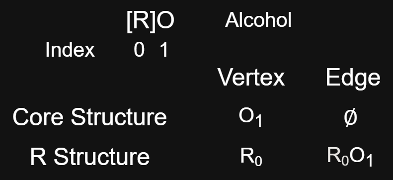

.. _theory-overview-ref:

Theoretical Overview
====================

This document discusses graphical theory and functional groups theory used in the IFG project for identification
of functional groups based on SMILES codes.

.. _graph-theory-ref:

Graphical Theory
----------------

In graph theory, a graph is a figure with circles and lines that is mathematically constructed with a set of vertices and edges [1]_.
Graph types are dependent upon graphical properties such as edge connection behaviors between vertices, 
data stored in the vertices and edges, and relationships behaviors of a graph with two or more other graphs. 
The type of graph derivable from a SMILES defined chemical structure is a Simple Undirected Connected Molecular graph [2]_. 
The molecular aspect indicates that the vertices and edges are repsectively representative of atoms and bonds of a molecule.
The simple, undirected, and connected aspect indicates that the edges and vertices follow a uniform pattern 
of connection throughout the molecular graph (View [1]_ for details about this classification). 
An example of a functional group and an organic molecule graph derived from their hydrogen-suppressed SMILES codes
is shown below:

.. figure:: _static/Molecular_Graphs.png

    Hydrogen suppressed Organic Molecule and Functional Group Molecular Graph Examples

Hydrogen suppression in a SMILES code simplifies its alphanumeric string and eliminates hydrogen vertices from appearing in the derived molecular graph. 
While this improves readability and simplifies SMILES code generation, this behavior poses an issue for hydrogen-sensetive functional group identification, where hydrogens are the distinguishing factor for correct identification accuracy 
(See :ref:`functional-group-theory-ref` and :ref:`hierarchical-functional-groups-ref` for details). To address this issue,
hydrogen-suppressed SMILES derived graphs must compute the number of hidden hydrogens attached to each vertex to support accurate functional group identification
capabilities (See the :ref:`hidden-hydrogens-computation-ref` for how IFG implements this behavior).

.. _functional-group-theory-ref:

Functional Groups Theory
------------------------

Functional groups are a collection of sub-structures found in organic molecules that have an influence
on the chemical behaviors of a molecule when exhibited. For example, combinations of functional groups in an organic 
molecule may have energy-efficiency related effects. This type of correlation can be beneficial for opto-electronic 
materials developers in pursuit of reducing energy consumption of opto-electronic devices. 

Functional group graphs defined from hydrogen-suppressed SMILES codes are charecterized by their `core` structure and their `R` structure. 
Their `core` structure is the set of edges and vertices which do not involve the symbol R, while
their `R` structure is the set of edges and vertices which do involve the symbol `R`. Below is an example:

    Core and R Structures for an Alcohol

The `core` structure contains `core` vertices and `core` edges, while the `R` structure contains `R` vertices and `R` edges.

An `R` vertex `and` its `R` edge `together` form an `R` group. `R` groups are generally defined as any single bound atom `including` single bound hydrogens based on the 
`R` group definition for functional groups listed `here`_. This general `R` group definition is applied during the identification process for functional groups in the :ref:`depth-first-search-ref`.
suppressed and implict hydrogens are assumed to be included in the *core* structure, however, hydrogens which are involved in a special `hydrogen-sensetive R` group based on a hierarchical functional group 
relationship become apart of the `R` structure (see :ref:`hierarchical-functional-groups-ref` for `hydrogen-sensetive R` groups).

.. _hierarchical-functional-groups-ref:

Hierarchical Functional Groups
++++++++++++++++++++++++++++++

Hierarchical functional groups are a set of two or more functional groups which have the same `core` structure, but which vary in their `R` structures based on `hydrogen-sensetive R` groups.
Any functional group part of a hierarchical set is called a hierarchical functional group. 
A common hierarchical set of functional groups is shown for the amine functional groups [3]_:

.. figure:: _static/Hierarchical_Functional_Groups.png

    Functional Group Hierarchy of Primary, Secondary, and Tertiary Amines

While the general `core` structure for each amine is the same (i.e a single nitrogen), the `R` structures differ based on two `hydrogen-sensetive R` groups. 
These two `hydrogen-sensetive R` groups change between `R` and `H` depending on the type of amine present. 
That is, the amine types are precisely distinguishable from one another based on whether or not these two `R` groups are fulfilled with a hydrogen or non-hydrogen single bond.

This behavior for hierarhcically related functional groups poses a type discrepancy under the the general definition of an `R` group `here`_ 
because the `hydrogen-sensetive R` groups become indistinguishable from one another.
To address this disparity, hierarchical functional groups require *hidden hydrogen exactness* to be type identifed accuratley in an organic molecule
(see :ref:`hierarchy-filter-implementation-ref` for how this is handled in IFG automatically).

.. _overlapping-functional-groups-ref:

Overlapping Functional Groups
+++++++++++++++++++++++++++++

Overlapping functional groups occur when the `core` structure of one functional group encapsualtes the `core` structure of another functional group.
A common exmaple of this behavior is between the ester and ketone functional groups:

.. figure:: _static/Overlap_Functional_Groups.png

    Functional Group Overlap of an ester with an ketone 

The `core` structure of C(=O) overlaps in both structures, while the ester contains a larger `core` structure including an oxygen in its C(=O)O `core` structure. 
This indicates that the ketone is overlapped by the ester, and all ester structures will always overlap with a ketone.
In this way, there are two methods for counting overlapping functional groups: both can be considered unique instances, 
or overlapped functional groups can be dropped without loss of data because of their implicit appearence in larger structures. 
Both versions of counts are computed in IFG (See :ref:`overlap-filter-implementation-ref` for details).

.. _ring-classified-functional-groups-ref:

Ring Classified Functional Groups
+++++++++++++++++++++++++++++++++

Functional groups can be categorized as `Aromatic`, `Non Aromatic`, and `Non Cyclic` based on the number of `core` atoms 
which appear inside of aromatic or non aromatic ring structures of the organic molecule. 
The ring type with the most `core` atoms recieves the corresponding nomenclature `even if there is only a single core atom in a ring`.

.. rubric:: Footnotes
.. [1] Introduction to Graph Theory Fourth Edition Robin J. Wilson 
.. [2] Simplified Molecular Input Line Entry Sytem https://en.wikipedia.org/wiki/Simplified_molecular-input_line-entry_system
.. [3] Other common examples include: Ester & Carboxylic Acid and Primary & Secondary Ketimine & Aldimine

.. _here: http://www.chem.ucla.edu/~harding/IGOC/R/r_group.html#:~:text=R%20group%3A%20An%20abbreviation%20for,halogens%2C%20oxygen%2C%20or%20nitrogen.