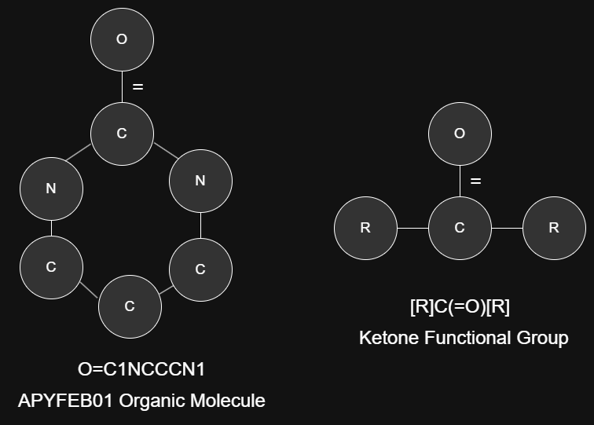
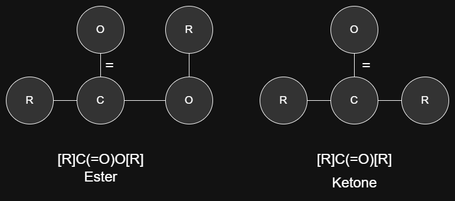

.. _theory-overview-ref:

Theoretical Overview
====================

This project makes usage of the molecular graph encoding scheme of the SMILES code [2]_ to execute a depth first sub-graph 
search algorithm for functional group instances inside of an organic molecule graph. 

.. _graph-theory-ref:

Graphical Theory
----------------

In graph theory, a graph is a figure with circles and lines that is mathematically constructed with a set of vertices and edges [1]_.
Graphs types are dependent upon graphical properties such as edge connection behaviors between vertices, 
data stored in the vertices and edges, and relationship behaviors of a graph with two or more other graphs. 
The type of graph derivable from a SMILES defined chemical structure is a Simple Undirected Connected Molecular graph [2]_. 
The molecular aspect indicates that the vertices and edges are repsectively representative of atoms and bonds of a molecule.
The simple, undirected, and connected aspect indicates that the edges and vertices follow a uniform pattern 
of connection throughout the molecular graph (View [1]_ for details about this classification). 
An example of a functional group and an organic molecule graph derived from their hydrogen-suppressed SMILES codes
is shown below:

    Hydrogen Supressed Organic Molecule and Functional Group Molecular Graph Examples

Hydrogen suppression in a SMILES code simlpifies its alphanumeric string and eliminates hydrogen vertices from appearing in the derived molecular graph. 
While this improves readability and simplifies SMILES code generation, this behavior poses an issue for hydrogen-sensetive functional group identification, where hydrogens are the distinguishing factor for correct identification accuracy 
(See :ref:`functional-group-theory-ref` and :ref:`hierarchical-functional-groups-ref` for details). Therefore,
hydrogen-supressed SMILES derived graphs must include the number of hidden hydrogens attached to each vertex to support fully accurate functional group identification
capabilities. (See the :ref:`implementation-ref` for how this behavior is included in IFG).

.. _functional-group-theory-ref:

Functional Groups Theory
------------------------

Functional groups are a collection of sub-structure patterns found in organic molecules that have an influence
on the chemical behaviors of a molecule when exhibited. For example, combinations of functional groups in an organic 
molecule may have energy-efficiency related effects. This type of correlation can be beneficial for opto-electronic 
materials developers in pursuit of reducing energy consumption of opto-electronic devices. 

Functional group sub-structure patterns defined graphically from SMILES codes are charecterized by their `core` structure and their `R` structure [3]_. 
Their `core` structure is the set of edges and vertices which involve only `core` atoms, while
their `R` structure is the set of edges and vertices which involve `R` vertices. 
`R` vertices `and` edges `together` form `R` groups which are generally defined as any single bound atom `including` single bound hydrogens based on the 
`R` group definition for functional groups listed `here`_.
This definition poses identification accuracy issues for :ref:`hierarchical-functional-groups-ref` which are handled in the 
:ref:`implementation-ref` phase of the algorithm.

.. _hierarchical-functional-groups-ref:

Hierarchical Functional Groups
------------------------------

Hierarchical functional groups are a set of two or more functional groups which have the same `core` structure, but which differ in `R` structure.
A common example of this behavior is shown for the Amine functional groups [4]_:

.. figure:: _static/Hierarchical_Functional_Groups.png

    Functional Group Hierarchy of Primary, Secondary, and Tertiary Amines

While the `core` structure is the same across each Amine (a single nitrogen), the number of `R` vertices differs. 
More specifically, there are two `hydrogen-sensetive R` vertices which change between `R` and `H` depending on the type of amine. 
The general definition of an `R` group `here`_ for the `hydrogen-sensetive R` vertices is too general because each type of amine is precisely distinguishable by whether or not the `hydrogen-sensetive R` vertex is a hydrogen or a non-hydrogen.
However, the `R` group definition `here`_ still applies too all general cases of functional groups without the knowledge of hierarhcical relationship (i.e. indidually).

In order to balance these two behaviors of `R` vertices in hierarhcical functional groups and non-hierarchical functional groups, 
all functional groups may be initally (or generally) identified by using the general `R` group definition `here`_ first. Then following this general procedure is 
a hierarhcical evaluation on hierarchically related functional groups which selects the most accurate hierarhcical type of functional group using the `hydrogen-sensetive R` vertices exhibited in the organic molecule
to decide the most accurate group. (See the :ref:`implementation-ref` for more details).

.. _overlapping-functional-groups-ref:

Overlapping Functional Groups
-----------------------------

Overlapping functional groups occur when the `core` structure of one functional group encapsualtes the `core` structure of another functional group.
A common exmaple of this behavior is between the Ester and Ketone functional groups:

    Functional Group Overlap of an Ester with an Ketone 

Both functional groups are valid and both may be listed as uniquely identified functional groups (See :ref:`implementation-ref` for details about how these types of groups are handled in the counting scheme for IFG)

Ring Classified Functional Groups
---------------------------------

Functional groups can be categorized as `Aromatic`, `Non Aromatic`, and `Non Cyclic` based on the number of `core` atoms 
which appear inside of aromatic or non aromatic ring structures of the organic molecule. 
The ring type with the most `core` atoms recieves the corresponding nomenclature (even if it is only a single `core` atom in a ring)

.. rubric:: Footnotes
.. [1] Introduction to Graph Theory Fourth Edition Robin J. Wilson 
.. [2] Simplified Molecular Input Line Entry Sytem https://en.wikipedia.org/wiki/Simplified_molecular-input_line-entry_system
.. [3] Core Refers to any atom symbol which is not an R, and R refers to any atom symbol which is an R
.. [4] Other common examples include: Ester & Carboxylic Acid and Primary & Secondary Ketimine & Aldimine

.. _here: http://www.chem.ucla.edu/~harding/IGOC/R/r_group.html#:~:text=R%20group%3A%20An%20abbreviation%20for,halogens%2C%20oxygen%2C%20or%20nitrogen.